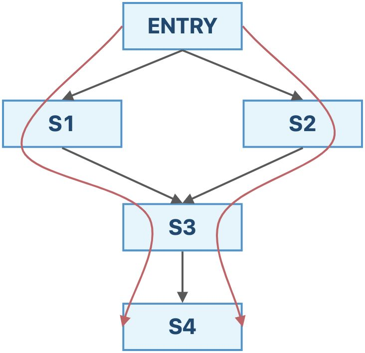
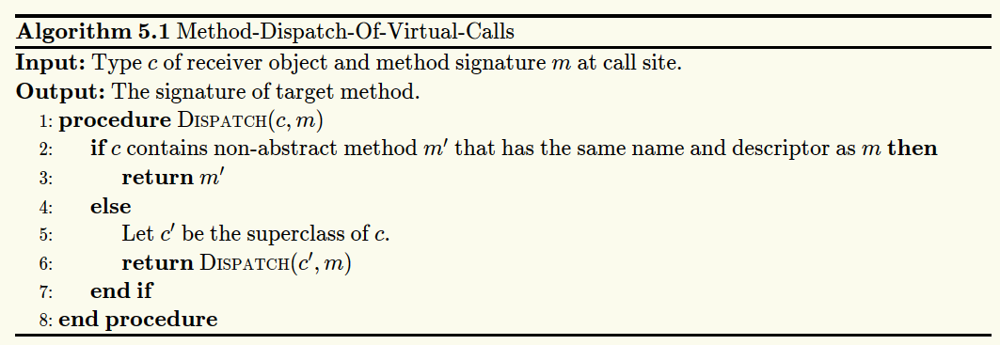
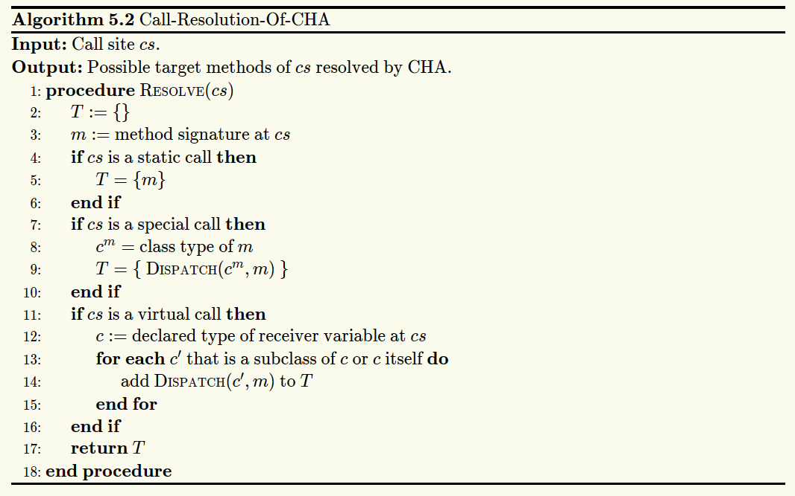

## 软件分析概述

###  静态分析（Static Analysis）和动态测试（Dynamic Testing）的区别是什么？
- **静态分析（Static Analysis）**是指在实际运行程序$P$之前，通过分析静态程序$P$本身来推测程序的行为，并判断程序是否满足某些特定的性质（Property）$Q$。
- 动态测试是指通过运行程序$P$，收集程序的运行时信息来观察代码运行状况。

### 完全性（Soundness）、正确性（Completeness）、假积极（False Positives）和假消极（False Negatives）分别是什么含义？

一个静态分析$S$。我们定义程序P的关于$Q$的真实行为为真相（Truth）。
- **完全性（Soundness）**：真相一定包含在$S$给出的答案中；
- **正确性（Completeness）**：$S$给出的答案一定包含在真相中。

记这个静态分析程序给出的答案集合$A$，真相集合为$T$，则完美的静态分析满足：

$$T \subseteq A \wedge A \subseteq T \Leftrightarrow A = T$$

其中，$T \subseteq A$体现了完全性，$A \subseteq T$体现了正确性。

- 假积极：记程序$P$的关于性质$Q$的静态分析$S$有**假积极（False Positive）**问题，当且仅当$S$给出的答案$A$和$P$关于$Q$的真相$T$满足如下关系：

$$\exists a \in A, a \notin T$$

其中，$a$称为一个**假积极实例（False Positive Instance）**，其实是一个**消极实例（Negative Instance）**。

- 假消极：记程序$P$的关于性质$Q$的静态分析$S$有**假消极（False Negative）**问题，当且仅当$S$给出的答案$A$和$P$关于$Q$的真相$T$满足如下关系：

$$\exists a \notin A, a \in T$$

其中，$a$称为一个**假消极实例（False Negative Instance）**，其实是一个**积极实例（Positive Instance）**。

### 为什么静态分析通常需要尽可能保证完全性？

- Sound 的静态分析可以帮助我们有效的缩小 debug 的范围，我们最多只需要在$A$范围内暴力排查掉所有的假积极实例（False Positive Instance）就可以了，人工排查的代价是可控的。
- Complete 的静态分析做不到这一点，它不能够帮助我们有效缩小 debug 的范围。因为假消极实例（False Negative Instance）$a\notin A$，所以$a$的范围是$P−A$。这里注意的是，虽然假消极的理论范围是$T−A$，但因为我们并不知道$T$是什么，所以只能从$P−A$中排查。而$P−A$往往是比$A$大得多的，因此排查假消极的代价是很大的。

### 如何理解抽象（Abstraction）和过近似（Over-Approximation）？

- **抽象（Abstraction）**：当我们考虑程序$P$的性质$Q$时，程序$P$中的各种值，我们或许不一定非得事无巨细。比如说，当我们考虑除零错误（Zero Division Error）的时候，对于某个值，我们只需要判定其是否为$0$即可，至于它具体是多大，我们其实不关心，因为它和我们要研究的性质$Q$没有直接关联。这种将$P$中的值的，和我们需要研究的性质$Q$相关的性质提取出来，从而忽略其他细节的过程，就是一个抽象的过程。
- **过近似（Over-Approximation）**：软件分析中的转移函数与控制流，针对程序中的语句，对抽象域上的结果提供转换规则，达到soundness的目标。

## 程序的中间表示
### 编译器（Compiler）和静态分析器（Static Analyzer）的关系是什么？
静态分析器是现代编译器的一部分。编译器由源代码生成中间表示之后，静态分析器对中间表示进行处理，编译器根据静态分析器的输出做出优化，或者报出错误与警告。

### 三地址码（3-Address Code, 3AC）是什么，它的常用形式有哪些？
一些常见的三地址码形式如下：
```
x = y bop z
x = uop y
x = y
goto L
if x goto L
if x rop y goto L
```
- `x`、`y`、`z`是变量的地址，地址可能是
  - 名字（Name），包括，
    - 变量（Variable）
    - 标签（Label）：用于指示程序位置，方便跳转指令的书写
  - 字面常量（Literal Constant），
  - 编译器生成的临时量（Compiler-Generated Temporary）；
- `bop`是双目操作符（Binary Operator），可以是算数运算符，也可以是逻辑运算符；
- `uop`是单目操作符（Unary Operator），可能是取负、按位取反或者类型转换；
- `L`是标签（Label），是标记程序位置的助记符，本质上还是地址；
- `rop`是关系运算符（Relational Operator），运算结果一般为布尔值。
- `goto`是无条件跳转，`if... goto`是条件跳转。

### 如何在中间表示（Intermediate Representation, IR）的基础上构建基块（Basic Block, BB）？
基块就是满足如下性质的最长指令序列：
- 程序的控制流只能从首指令进入；
- 程序的控制流只能从尾指令流出。

一个基块的领导者就是这个基块的首指令，整个程序中的领导者有如下3种：
- 整个程序的首指令；
- 跳转指令（包括条件跳转和无条件跳转）的目标指令；
- 跳转指令（包括条件跳转和无条件跳转）紧接着的下一条指令。

从前到后扫一遍，获得所有的Leader。再从前到后扫一遍，按Leader分段即可。

### 如何在基块的基础上构建控制流图（Control Flow Graph, CFG）?
程序控制流的产生来源于两个地方：
- 天然的顺序执行，这是计算系统天然存在的一种控制流；
- 跳转指令，这是人为设计添加的一种控制流。

扫一遍所有的基块：
- 如果一个基块的末尾是跳转，就从这个基块向跳转目标连一条边；
- 只要一个基块的末尾不是无条件跳转，就从这个基块向下一个基块连一条边。

## 数据流分析
### 定义可达性（Reaching Definitions）分析、活跃变量（Live Variables）分析和可用表达式（Avaliable Expressions）分析分别是什么含义？
- 可达性分析：程序中变量$v$的一个**定义（Definition）**是指一条给$v$赋值的语句。我们称在程序点$p$处的一个定义$d$**到达（Reach）**了程序点$q$，如果存在一条从$p$到$q$的“路径”（控制流），使得在这条路径上，定义$d$始终未被**覆盖（Kill）**。称分析每个程序点处能够到达的定义的过程为**定义可达性分析（Reaching Definition Analysis）**。定义可达性分析可以应用于检测程序中可能存在的未被定义的变量。
- 活跃变量分析：在程序点$p$处
  - 某个变量$v$的变量值（Variable Value）可能在之后的某条控制流中被用到，我们就称变量$v$是程序点$p$处的**活变量（Live Variable）**
  - 否则，我们就称变量$v$为程序点$p$处的**死变量（Dead Variable）**。

  分析在各个程序点处所有的变量是死是活的分析，称为**活跃变量分析（Live Variable Analysis）**。通过活跃变量分析，可以知道某个变量当前所储存的值在之后有没有可能被用到。
- 可用表达式：我们称一个表达式（Expression）`x op y`在程序点$p$处是**可用的（Avaliable）**，如果：
  - **所有**的从程序入口到程序点$p$的路径都**必须**经过`x op y`表达式的评估（Evaluation），并且
  - 在最后一次`x op y`的评估之后，没有$x$或者$y$的重定义（Redefinition）。
  
  对于程序中每个程序点处的可用表达式的分析，我们称之为**可用表达式分析（Avaliable Expression Analysis）**。有了可用表达式分析，在计算表达式的时候可以直接复用之前的结果。

### 上述三种数据流分析（Data Flow Analysis）有哪些不同点？又有什么相似的地方？
- 数据抽象
  - 可达性分析：对于每个程序点，分析能够到达该点的定义的集合。
  - 活跃变量分析：对于每个程序点，分析该点所有活变量的集合。
  - 可用表达式分析：对于每个程序点，分析该点所有可用表达式的集合
- 约束分析
  - 可达性分析：使用过近似（可能性分析），正向分析，转移方程：
    
    $$OUT[B] = gen_B \cup (IN[B] - kill_B)$$
    
    控制流约束：
    
    $$IN[B] = \bigcup_{P\in pre(B)}OUT[P]$$

    初始化的时候，所有基块$B$的$OUT[B]$都被初始化为空集。
  - 活跃变量分析：使用过近似（可能性分析），反向分析，转移方程：
    
    $$IN[B] = use_B \cup (OUT[B] - def_B)$$

    控制流约束：

    $$OUT[B] = \bigcup_{S\in suc(B)}IN[S]$$

    初始化的时候，所有基块$B$的$IN[B]$都被初始化为空集。
  - 可用表达式分析：使用欠近似（必然性分析），正向分析，转移方程：
    
    $$OUT[B] = gen_B \cup (IN[B] - kill_B)$$

    其中$gen_B$为基块$B$中的所有的表达式的集合，$kill_B$为**程序中所有的其中变量被$B$重定义的表达式**的集合。控制流约束：

    $$IN[B] = \bigcap_{P\in pre(B) OUT[P]}$$

    初始化的时候，除了程序入口之外的其他基块$B$的$OUT[B]$都应该被初始化为全集。

### 如何理解数据流分析的迭代算法？数据流分析的迭代算法为什么最后能够终止？
在迭代算法中，每轮迭代都逐一分析所有基块，尝试对基块的分析结果进行更新。若在某轮迭代中，所有基块的分析结果都不变，那么算法终止。

以定义可达性分析为例，$OUT[B]$不会收缩，只会变大或者不变。程序中所有定义构成的全集$D$是有限的，基块集合$B$也是有限的，在最慢的情况下，每次迭代只能使得一个基块$B$的$OUT$集合增加一个元素，此时需要的迭代次数是$|D|\times |B|$，这是有限的。

### 如何从函数的角度来看待数据流分析的迭代算法？

- 给定一个具有$k$个结点的程序流程图CFG，对于CFG中的每个结点$n$，迭代算法的每一次迭代都会更新$OUT[n]$；
- 设数据流分析的定义域为 $V$，我们可以定义一个$k$元组（k-tuple）来表示每次迭代后的分析值：

  $$(OUT[n_1],OUT[n_2],\dots,OUT[n_k]) \in V \times V \times\dots\times V=V^k$$
 
- 每次迭代可以视为将$V^k$中的某个值映射为$V^k$中的另一个值，通过状态转移方程和控制流约束式，这个过程可以抽象为一个函数$F_{V^k \to V^k}$；
- 然后这个算法会输出一系列的k元组，直到某两个连续输出的k元组完全相同的时候算法终止。

| 初始化 | $(\perp, \perp, \dots, \perp) = X_0$ |
| --- | --- |
| 第$1$次迭代 | $(v_1^1, v_2^1, \dots, v_k^1) = X_1 = F(X_0)$ |
| 第$2$次迭代 | $(v_1^2, v_2^2, \dots, v_k^2) = X_2 = F(X_1)$ |
| …… | …… |
| 第$i$次迭代 | $(v_1^i, v_2^i, \dots, v_k^i) = X_i = F(X_{i-1})$ |
| 第$i+1$次迭代 | $(v_1^{i+1}, v_2^{i+1}, \dots, v_k^{i+1}) = X_{i+1} = F(X_i) = X_i$ |

其中，$v_i^j$表示第$i$个结点第$j$次迭代后的数据流值。

### 格和全格的定义是什么？
- 格：考虑偏序集 $(P,\preceq)$，如果$\forall a,b\in P$，$a\vee b$和$a\wedge b$都存在，则我们称$(P,\preceq)$为**格（Lattice）**。简单理解，格是每对元素都存在最小上界和最大下界的偏序集。
  - $(\mathbb{Z},\leq)$是格，其中$\vee=\max,\wedge=\min$；
  - $(2^S,\subseteq)$ 也是格，其中$\vee=\cup,\wedge=\cap$。
- 全格：考虑偏序集$(P,\preceq)$，如果$\forall S \subseteq P$，$\vee S$和$\wedge S$都存在，则我们称$(P,\preceq)$为**全格（Complete Lattice）**。简单理解，全格的所有子集都有最小上界和最大下界。
  - 由于$(\mathbb{Z},\leq)$，子集$\mathbb{Z}^+$没有最小上界，因此它不是全格；
  - 与之不同的， $(2^S,\subseteq)$就是一个全格。
  每一个全格$(P,\preceq)$都有一个**序最大（Greatest）**的元素$⊤=\vee P$称作**顶部（Top）**，和一个**序最小（Least）**的元素$⊥=\wedge P$称作**底部（Bottom）**。

每一个**有限格（Finite Lattice）**$(P,\preceq)$（$P$是有限集）都是一个全格。

### 如何理解不动点定理？
- 单调性：我们称一个函数$f_{L\to L}$（$L$是格）是**单调的（Monotonic）**，具有**单调性（Monotonicity）**，如果$\forall x,y\in L,x\preceq y\Rightarrow f(x) \preceq f(y)$。
- 不动点：我们称$x$是一个函数$f$的**不动点（Fixed Point）**，如果$f(x)=x$。
- 不动点定理：考虑一个全格$(L,\preceq)$。我们定义一个**格的高度**$h$为从底部到顶部的最长路径。如果$f_{L\to L}$是单调的且$L$是有限集，那么**序最小的不动点（Least Fixed Point）**可以通过如下的迭代序列找到：

  $$f(⊥),f(f(⊥)),...,f^{h+1}(⊥)$$

  **序最大的不动点（Greatest Fixed Point）**可以通过如下的迭代序列找到：

  $$f(⊤),f(f(⊤)),...,f^{h+1}(⊤)$$

  其中，$h$是$L$的高度。

### 怎样使用格来总结可能性分析与必然性分析？
我们将采用过近似策略，输出所有可能为真的信息的数据流分析称为**可能性分析（May Analysis）**，将采用欠近似策略，输出信息必然为真的数据流分析称为**必然性分析（Must Analysis）**。

- 可能性分析：以Reaching Definitions为例,从某个程序点的视角来看，初始化的时候是$⊥$，即没有任何定义可以到达此处，然后我们一次次迭代，每次迭代向前走最安全的一步，发现越来越多的定义能够到达此处，直到算法在一个最小的不动点处停了下来。

  首先，初始化的状态是不安全的，因为没有任何定义可达显然是一个最不正确的结论。其次，$⊤$状态是最安全的，所有的定义都“可能”到达此处，但这是一个没有用的平凡的结论，因为它并不能帮到我们什么，且我们啥也不干都知道这个结论。

  我们假设这个程序点处真实可达的定义集合为 Truth ，那么 包含 Truth 且越接近 Truth 的答案才是最有价值的。因此，在包含 Truth 的前提下最小的不动点是最好的。

  至于最小的不动点为什么会包含 Truth ，这是由我们设计的转移方程和控制流约束函数所决定的，需要具体的问题具体分析。言下之意，如果我们设计的状态转移方程和控制流约束函数不合理，最小不动点可能会是不安全的，也就是算法可能会出错。
- 必然性分析：我们以典型的必然性分析——Avaliable Expressions为例。从某个程序点的视角来看，我们初始化的时候是 $⊤$ ，即所有的表达式都是可用的，然后我们一次次迭代，每次迭代向前走最安全的一步，发现越来越少的表达式是可用的，直到算法在一个最大的不动点处停了下来。

  首先，初始化的状态是不安全的，因为所有的表达式都可用显然是一个最不正确的结论（如果我们用这个结论来作表达式优化，是最会导致程序错误的）。其次，$⊥$ 状态是最安全的，所有的表达式都不可用（也就是我们并不能优化，啥也不用干就行），但这是一个没有用的结论，因为它并不能帮助我们优化表达式，减少计算次数。

  我们假设这个程序点处真实可用的表达式集合为 Truth ，那么包含于 Truth （注意，可能性分析里面是包含，必然性分析里面是包含于）且越接近 Truth 的答案才是最有价值的。因为包含于 Truth 说明用这个结果做优化一定不会错，越接近 Truth 那么我能够优化掉的表达式才越多，优化效果越好。因此，在包含于 Truth 的前提下最大的不动点是最好的。

  至于最大的不动点为什么会包含于 Truth ，这是由我们设计的状态转移方程和控制流约束函数所决定的，需要具体问题具体分析。言下之意，如果我们设计的状态转移方程和控制流约束函数不合理，最大不动点可能会是不安全的，也就是算法可能会出错。

### 迭代算法提供的解决方案与 MOP 相比而言精确度如何？
MOP解决方案：数据流分析的**全路交汇（Meet-Over-All-Paths）**的解决方案通过如下步骤计算某个程序点$(s_i,s_{i+1})$处的数据流值，记为$MOP[s_i]$:

- 考虑从程序入口到$s_i$处的路径$P$的状态转移方程$F_P$，所有路径的集合记为$Paths(ENTRY,s_i)$；
- 使用联合或者交汇操作来求这些值的最小上界或者最大下界。
  
  形式化表示为：

  $$MOP[s_i]=\bigvee_{\forall P\in Paths(ENTRY,s_i)}F_P(OUT[ENTRY])$$

  或

  $$MOP[s_i]=\bigwedge_{\forall P\in Paths(ENTRY,s_i)}F_P(OUT[ENTRY])$$

这显然是一种非常暴力的算法。



我们通过一个例子来比较一下这两个算法。如果采用迭代算法，我们最终得到的结果为：

$$IN[s_4]=f_{s_3}(f_{s_1}(OUT[ENTRY])\vee f_{s_2}(OUT[ENTRY]))$$

如果采用MOP算法，我们最终得到的结果为：

$$IN[s_4]=f_{s_3}(f_{s_1}(OUT[ENTRY]))\vee f_{s_3}(f_{s_2}(OUT[ENTRY]))$$

从这个例子中，我们可以发现，迭代算法求的是$F(x\vee y)$ ，而MOP算法求的是$F(x)\vee F(y)$（如果是交汇操作也是类似的）。
由于$F(x)\vee F(y) \preceq F(x∨y)$，迭代算法的精度不如MOP。

我们称定义在格$(L,\preceq)$上的函数$f(x)$满足**分配律（Distributive）**，如果$f(x\vee y)=f(x)\vee f(y)$，$f(x\wedge y)=f(x)\wedge f(y)$。当$F(x)$满足分配律的时候，迭代算法的精度和MOP是一样的。并且，上面提到的三种数据流分析的状态转移方程都是满足分配律的。也就是说，在这些情景下，迭代算法可以达到MOP算法的精度，但是其实现要比MOP简单得多。

### 什么是常量传播（Constant Propagation）分析？

**常量传播（Constant Propagation）**问题：考虑程序点$p$处的变量$x$，求解$x$在$p$点处是否保证（Guarantee）是一个常量。
如果我们知道了某些程序点处的某些变量一定是一个常量的话，我们就可以直接优化，将这个变量视为常量，从而减少内存的消耗（可以在编译的时候就完成一部分计算，并且有些常量并不需要分配储存它的内存空间）。

我们可以用一个有序对$(x,v)$的集合表示每个程序点处的抽象程序状态，其中$x$是变量名，$v$是变量的常数值，$v$的取值可能有某个常数，$UNDEF$（Undefined，未定义的）或$NAC$（Not A Constant，不是常量）。

状态转移：考虑语句`s: x = ...`，定义其状态转移方程为

$$F:OUT[s]=gen_s \cup (IN[s]−{(x,\_)})$$

定义$gen_s$如下：
- `s: x = c; //c is a constant` ，则$gen_s=\{(x,c)\}$ ；
- `s: x = y`; ，则$gen_s=\{(x,val(y))\}$；
- `s: x = y op z`; ，则$gen_s=\{(x,f(y,z))\}$，其中，

$$f(y,z) = \begin{cases}
val(y) op val(z) & if \quad y\ and\ z\ are\ constants \\
NAC              & if \quad y\ or\ z\ isNAC \\
UNDEF            & otherwise 
\end{cases}$$

常量传播的转移方程是不满足分配律的。

控制流约束：
- $(x,v) \wedge (x,NAC)=(x,NAC)$，变量和任意常量交汇还是变量，因为我们需要保证是一个常量，采用的是必然性分析的策略；
- $(x,UNDEF) \wedge (x,v)=(x,v)$，未初始化的变量并不是我们这个问题的关注点（言下之意出了Undefined的错误，锅由Reaching Definitions背），我们当它不存在即可。
- $(x,v_1)∧(x,v_2)=\begin{cases}(x,v_1), &if v_1=v_2 \\ (x,NAC),&otherwise\end{cases}$，两个不同的值汇聚到某一点，说明这个变量不是常量，否则，在这个程序点处，我们可以将其视为常量。

### 数据流分析的工作表算法（Worklist Algorithm）是什么？

工作表算法是对迭代算法的优化，用一个集合储存下一次遍历会发生变化的基块，这样，已经达到不动点的基块就可以不用重复遍历了。
工作表算法本质上是图的广度优先遍历算法的变体，只是加入了一些剪枝的逻辑，每一轮只遍历可能会发生变化的结点，不发生变化的结点提前从遍历逻辑中去除。

## 过程间分析
### 如何通过类层级结构分析（Class Hierarchy Analysis, CHA）来构建调用图（Call Graph）？
- 调用图：调用图是程序中各过程（Procedure）之间调用关系的一种表示，考虑程序中的所有**调用点（Call Site，调用表达式所在的语句）**，所有的从调用点到“**目标方法（Target Method）**——即**被调用者（Callee）**”的边组成的集合为**调用图（Call Graph）**。记程序中所有调用点的集合为$V_1$，所有的方法的集合为$V_2$，调用图$G$满足$G\subseteq V_1\times V_2$。

- 类层级结构分析：通过查找类的层级结构来解析目标方法的过程，称之为**类层级结构分析（Class Hierarchy Analysis，CHA）**。
  - 虚调用的方法派发算法，就是从接受对象所在的类开始，按照从子类向到基类的顺序查找，直到找到一个方法名和描述符都相同的非抽象方法为止。
  
  - CHA的调用解析算法处理虚调用的方式是暴力的枚举，将变量声明类型及其子类中所有和调用点处签名匹配的方法都视为可能的目标方法。
  
  此算法中$c$的子类包括$c$的直接子类和间接子类。

- 通过CHA构建整个程序调用图的基本过程为：
  - 从入口方法开始（通常为`main`方法）；
  - 对于每个可达的方法$m$，通过CHA解析$m$中的每个调用点$cs$的目标方法，即$Resolve(cs)$；
  - 重复上述过程，直到没有发现新的方法为止。

### 如何理解过程间控制流图（Interprocedural Control-Flow Graph, ICFG）的概念？

定义一个程序的**过程间控制流图（Interprocedural Control Flow Graph，ICFG）**由两个部分组成：
- 程序中所有方法的控制流图，其中的边称为**CFG边（CFG Edge）**；
- 两种额外的边：
  - **调用边（Call Edge）**：从调用点（Call Site）到调用点对应的被调用者（Callee）的入口结点（Entry Node）的边；
  - **返回边（Return Edge）**：从被调用者的出口结点（Exit Node）到**返回点（Return Site, 控制流中紧接着调用点的语句）**的边。

即`ICFG = CFG + call & return edges`。


CFG边中从调用点到对应返回点的边称为调用-返回边（Call-to-return edges），除此之外的边称为普通边（Normal Edges）。即`CFG Edges = Call-to-return Edges + Normal Edges`。调用-返回边相当于为子过程不需要用到的外部状态提供了一条传播的捷径。

### 如何理解过程间数据流分析（Interprocedural Data-Flow Analysis, IDFA）的概念？

我们将基于CFG分析单个方法内部的数据流分析称为**过程内数据流分析（Intraprocedural Data-Flow Analysis）**，将基于ICFG分析整个程序的数据流分析称为**过程间数据流分析（Interprocedural Data-Flow Analysis）**。

定义数据流沿着ICFG中的边转移的过程为边转移（Edge Transfer），分为四种：
- 普通边转移（Normal Edge Transfer）：数据流沿着某个方法的CFG中的边的转移函数；
- 调用-返回边转移（Call-Return Edge Transfer）：数据流从调用点沿着调用-返回边到返回点的转移函数；
- 调用边转移（Call Edge Transfer）：数据流从调用点（见定义5.3）沿着调用边转移到被调用者的入口结点的转移函数；
- 返回边转移（Return Edge Transfer）：数据流从被调用者的出口结点沿着返回边转移到返回点（见定义5.8）的转移函数。

称CFG中结点所对应的状态转移方程为结点转移（Node Transfer）， 包括：
- 调用结点转移（Call Node Transfer）：调用点对应的结点的状态转移方程；
- 其他结点转移（Other Node Transfer）：调用点以外的其他结点的状态转移方程。

### 如何进行过程间常量传播（Interprocedural Constant Propagation）分析？

- 结点转移：
  - 调用结点转移：恒等函数（Identity Function，即直接将输入当输出返回的函数）；
    - 调用点左值变量留给调用-返回边处理；
  - 其他结点转移：和过程内的常量传播一致；
- 边转移：
  - 普通边：恒等函数
  - 调用-返回边：消除调用点的**左值变量（Left-hand-side Variable, LHS Variable）**的值，传播其他本地变量的值；
  - 调用边：传递参数值；
  - 返回边：传递返回值。

## 指针分析
### 什么是指针分析（Pointer Analysis）？

我们将分析一个指针可能指向的**内存区域（Memory Location）**，以**程序（Program）**为输入，以程序中的**指向关系（Point-to Relation）**为输出的分析称作**指针分析（Pointer Analysis）**。

### 如何理解指针分析的关键因素（Key Factors）？

| 因素 | 问题 | 选择 |
| --- | --- | --- |
| **堆抽象（Heap Abstraction）** | 如何对堆区内存建模？ | 分配点（Allocation-site）<br/> 无储存（Storeless）|
| **上下文敏感性（Context Sensitivity）** | 如何对调用语境建模？ | 上下文敏感（Context-sensitive）<br/> 上下文不敏感（Context-insensitive）|
| **流敏感性（Flow Sensitivity）** | 如何对控制流建模？ | 流敏感（Flow-sensitive）<br/> 流不敏感（Flow-insensitive）|
| **分析范围（Analysis Scope）** | 程序的哪个部分应该被分析？ | 全程序（Whole-program）<br/> 需求驱动（Demand-driven）|

#### 堆抽象：
**堆抽象（Heap Abstraction）**是指，为了保证静态分析能够正常终止，将**动态分配的（Dynamically Allocated）**，**无界的具体对象（Unbounded Concrete Objects）**建模成**有限/有界的抽象对象（Finite/Bounded Abstract Objects）**的过程。

将同一**分配点（Allocation Site ，通常是一条`new`语句）**处分配内存而产生的所有具体对象抽象成一个抽象的对象，称这种堆抽象的方式为**分配点抽象（Allocation-Site Abstraction）**。一个静态的程序总是有限的，因此程序中的分配点也是有限的，所以我们抽象出来的抽象对象的个数也一定是有限的了。

例：在选择分配点抽象的情况下，尽管`new`了3个`A`，但是抽象成同一个对象。
```
for (i = 0; i < 3; i++) {
    a = new A();
    ......
}
```

#### 上下文敏感性：
称一个静态分析是**上下文敏感的（Context-Sensitive, C.S.）**，如果它区分一个方法的不同**调用语境（Calling Context）**；称一个静态分析是**上下文不敏感的（Context-Insensitive, C.I.）**，如果它将一个方法所有的调用语境汇合到一起分析。在上下文敏感的分析中，对于每一个调用的上下文都会单独分析，因此，一个方法可能在不同的上下文中被分析很多次。

#### 流敏感性：
称一个静态分析是**流敏感的（Flow-sensitive）**，如果它尊重语句的执行顺序；称一个静态分析是**流不敏感的（Flow-insensitive）**，如果它忽略控制流顺序，将程序视为一个无序语句的集合来对待。

#### 分析范围：
称为程序中所有的指针计算指向信息的指针分析为**全程序分析（Whole-program Analysis）**；称只计算会影响**特定兴趣点（Specific Sites of Interest）**的指针的指向信息的指针分析为**需求驱动分析（Demand-driven Analysis）**。

### 我们在指针分析的过程中具体都分析些什么？
只聚焦于**指针影响型语句（Pointer-affecting Statements）**：
| 语句类型 | 示例 |
| :-: | :-: |
| New（创建新对象） | `x = new T()` |
| Assign（赋值语句） | `x = y` |
| Store（字段存储语句） | `x.f = y` |
| Load（字段载入语句） | `y = x.f` |
| Call（方法调用语句） | `r = x.k(a, ...)` |

这些语句会影响下列类型的指针：
- 本地变量（Local Variable），形如`x`；
- 静态域（Static Field），形如`C.f`；
  - 有时候也称为全局变量（Global Variable）
- 实例域/实例字段（Instance Field），形如`x.f`；
  - 在指针分析的时候建模成`x`指向的对象的域`f`；
- 数组元素（Array Element），形如`array[i]`；
  - 在指针分析时，我们会忽略数组下标，建模成`array`指向的一个对象，这个对象只有一个字段`arr`，可能指向数组中存放的任意值。

对于数组的简化，下面是一个例子：
- 实际代码
  ```java
  array = new String[10];
  array[0] = "x";
  array[1] = "y";
  s = array[0];
  ```
- 指针分析视角的代码
  ```java
  array = new String[];
  array.arr = "x";
  array.arr = "y";
  s = array.arr;
  ```

### 指针分析的规则（Pointer Analysis Rules）是什么？

### 如何理解指针流图（Pointer Flow Graph）？

### 指针分析算法（Pointer Analysis Algorithms）的基本过程是什么？

### 如何理解方法调用（Method Call）中指针分析的规则？

### 怎样理解过程间的指针分析算法（Inter-procedural Pointer Analysis Algorithm）？

### 即时调用图构建（On-the-fly Call Graph Construction）的含义是什么？

### 上下文敏感（Context Sensitivity, C.S.）是什么？

### 上下文敏感堆（C.S. Heap）是什么？

### 为什么 C.S. 和 C.S. Heap 能够提高分析精度？

### 上下文敏感的指针分析有哪些规则？

### 如何理解上下文敏感的指针分析算法（Algorithm for Context-sensitive Pointer Analysis）？

### 常见的上下文敏感性变体（Context Sensitivity Variants）有哪些？

### 常见的几种上下文变体之间的差别和联系是什么？

## 静态分析与安全
### 信息流安全（Information Flow Security）的概念是什么？
**信息流安全（Information Flow Security）**是指通过追踪信息是如何在程序中流动的方式，来确保程序安全地处理了它所获得的信息。

### 如何理解机密性（Confidentiality）与完整性（Integrity）？
**机密性（Confidentiality）**指的是阻止机密的信息泄漏，**完整性（Integrity）**指的是阻止不信任的信息污染受信任的关键信息。
可以理解为读保护、写保护。

### 什么是显式流（Explicit）和隐蔽信道（Covert Channels）？
- 信息可以通过直接拷贝的方式进行流动，这样的信息流称为**显式流（Explicit Flow）**。
- 信息可以通过影响控制流的方式向外传递，这样的信息流称为**隐式流（Implicit Flow）**。例如以下代码，没有直接拷贝，却可以通过影响控制流的方式传递信息。
  ```java
  secret = getSectre();
  if (secret < 0)
      publik = 1;
  else
      publik = 0;
  ```
- 称在计算系统中指示信息的机制为**信道（Channels）**。如果这个指示信息的机制的本意并不是信息传递，这样的信道称为**隐蔽信道（Covert/Hidden Channels）**。

### 如何使用污点分析（Taint Analysis）来检测不想要的信息流？

- 污点分析：**污点分析（Taint Analysis）**将程序中的数据分为两类：
  - 关心的敏感数据，我们会给这些数据加标签，加上标签后叫做 污点数据（Tainted Data） ；
  - 其他数据，叫做 无污点数据（Untainted Data） 。

  污点分析追踪污点数据是如何在程序中流动的，并且观察它们是否流动到了一些我们关心的敏感的地方。其中，污点数据产生的地方称为**源头（Source）**，我们不希望污点数据流向的敏感地带称为**水槽（Sink）**。
- 分析机密性
  - 源头：保密数据源
  - 水槽：泄漏点
- 分析完整性
  - 源头：不信任数据源
  - 水槽：关键计算

## 基于 Datalog 的程序分析
### Datalog 语言的基本语法和语义是什么？
Datalog 的语法语义由两部分组成，数据（Data）和逻辑（Logic），这种语言没有副作用，没有控制流，没有函数，也不是图灵完备的语言。在 Datalog 中，用谓词表示数据，用规则表示逻辑。

### 如何用 Datalog 来实现指针分析？

### 如何用 Datalog 来实现污点分析？

## CFL 可达与 IFDS

### 什么是 CFL 可达（CFL-Reachability）？

### IFDS（Interprocedural Finite Distributive Subset Problem）的基本想法是什么？

### 怎样的问题可以用 IFDS 来解决？

## 完全性与近似完全性

### 近似完全性（Soundiness）的动机和概念是什么？

### 为什么 Java 反射（Reflection）和原生代码是难分析的？

#### Java 反射
**反射（Reflection）**是Java编程语言中的一个特性。它允许正在执行的Java程序检查或“自省”自身，并操纵程序的内部属性。


#### 原生代码
**Java原生接口（Java Native Interface, JNI）**是JVM的一个功能模块，允许Java代码和原生代码（C/C++）之间的交互。
Java的分析器无法直接分析C/C++的接口。所以这是一个难问题。
